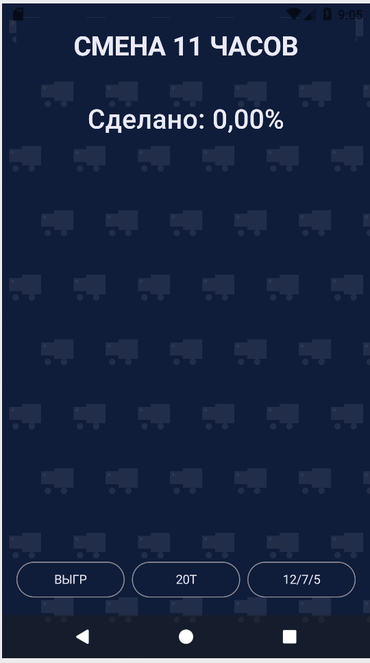
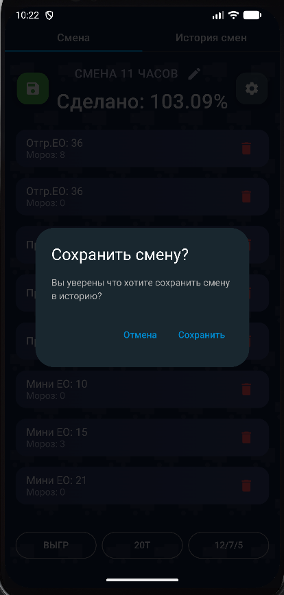
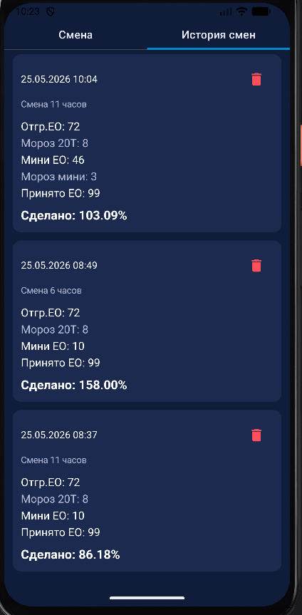
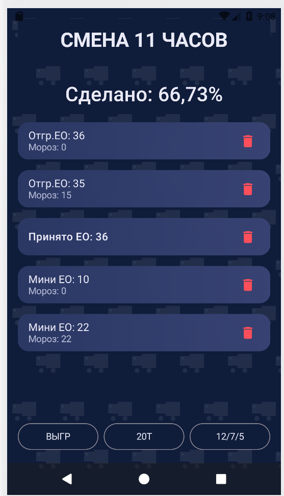

# Loader Calculator

Android-приложение для учёта работы грузчиков на складе. Позволяет фиксировать погрузки/выгрузки за 11-часовую смену и автоматически рассчитывать процент выработки.

> **Примечание:** Это мой первый учебный проект. Код рабочий, полностью идея не реализована,
> и будет переписан.

<!-- Скриншоты -->
## Скриншоты

<p align="center">
  
  &nbsp;&nbsp;
  
</p>

<p align="center">
  
  &nbsp;&nbsp;
  
</p>

## Возможности

- Учёт трёх типов работ:
  - **20Т** — погрузка фур (20 тонн)
  - **12/7/5** — погрузка мини-машин
  - **ВЫГР** — выгрузка (приёмка товара)
- Учёт замороженных палет (ЕО «Мороз») с повышающим коэффициентом
- Автоматический расчёт процента выработки за смену
- Добавление, редактирование (долгое нажатие) и удаление записей
- Сохранение данных в локальную базу (Room)

## Формула расчёта

```
нормо-часы = (палеты_20Т / 25) + (палеты_мини / 20) + (палеты_выгрузка × 0.06) + (палеты_мороз × 0.02)

выработка % = (нормо-часы / 11) × 100
```

## Технологии

| Категория | Стек |
|-----------|------|
| Язык | Kotlin |
| UI | Jetpack Compose, Material 3 |
| Архитектура | Clean Architecture, MVVM |
| DI | Hilt (Dagger) |
| БД | Room |
| Асинхронность | Coroutines, Flow |

## Структура проекта

```
com.pobezhkin.loadercalculator/
├── data/               # Слой данных
│   ├── model/          # Room-сущности (Entity)
│   └── workshift/      # DAO, база данных, репозиторий
├── domain/             # Бизнес-логика
│   ├── model/          # Доменные модели
│   ├── repository/     # Интерфейс репозитория
│   ├── usecase/        # Use-кейсы (CRUD для каждого типа)
│   └── percent/        # Расчёт выработки
├── presentation/       # UI-слой
│   ├── viewmodel/      # ViewModel
│   └── screens/        # Composable-экраны
└── DI/                 # Модуль Hilt
```

## Требования

- Android 7.0+ (API 24)
- Android Studio Hedgehog или новее

## Сборка и запуск

1. Клонируйте репозиторий:
   ```bash
   git clone https://github.com/pobezhkin/Loadercalculator.git
   ```
2. Откройте проект в Android Studio
3. Синхронизируйте Gradle
4. Запустите на эмуляторе или устройстве

## Лицензия

Проект распространяется без лицензии — используйте как хотите.
